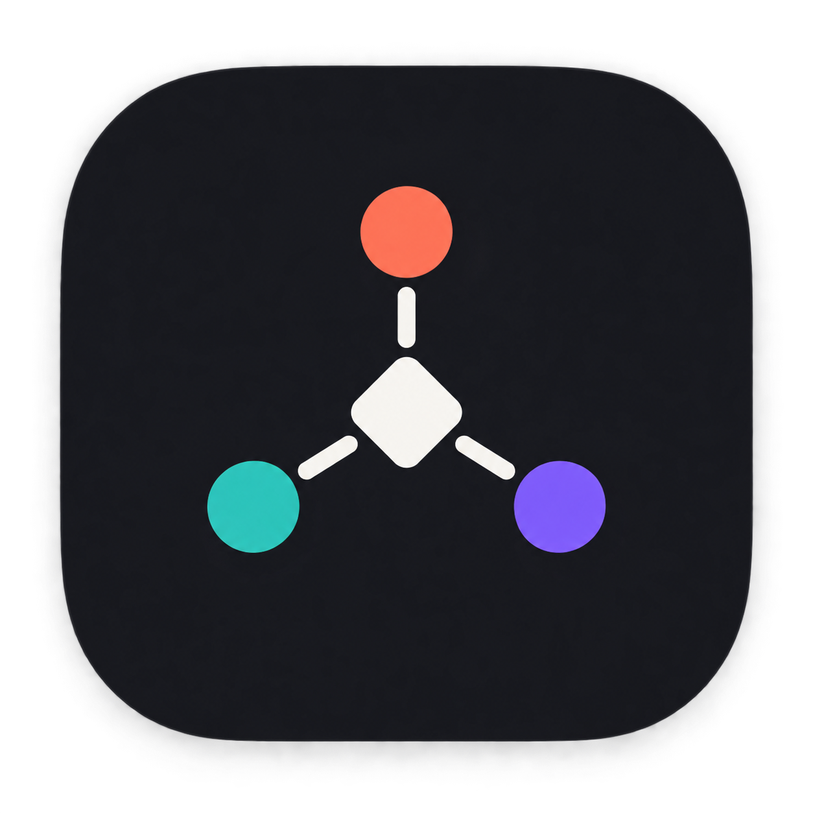

# Ajan Konseyi



Claude Code, OpenAI Codex ve Antigravity/Gemini ajanlarını aynı proje ve sohbet
bağlamında çalıştıran yerel macOS uygulaması.

Ajan Konseyi kendi yapay zekâ API anahtarını istemez. Bilgisayarınızda kurulu
CLI araçlarını ve bu araçlarda açtığınız abonelik oturumlarını kullanır.

## Neler yapabilir?

- Koordinatör, projeyi görevlere ayırır ve uygun ajana dinamik olarak dağıtır.
- Claude ile Codex kod yazar, test eder ve birbirlerinin değişikliklerini inceler.
- Antigravity araştırma, görsel üretimi, medya analizi ve tarayıcı/UX testi yapar.
- Ajanlar çıktıları birbirleriyle paylaşır; itiraz, revizyon, tartışma, oylama ve son doğrulama turlarıyla ortak sonuca ulaşır.
- Görsel, PDF, belge, tablo, ses, video, arşiv ve kod dosyaları aynı sohbetten gönderilebilir ve önizlenebilir.
- GitHub, Gmail, Google Drive, Figma, Canva, Slack ve Vercel görevleri bağlı Codex araçları veya güvenli ortak köprü üzerinden kullanılabilir.
- Konuşmalar projelerin altında saklanır ve ajan/model değişse bile bağlam korunur.

## macOS’a kurulum

1. GitHub sayfasındaki **Releases** bölümünden ZIP dosyasını indirin.
2. ZIP’i açın ve **Ajan Konseyi.app** dosyasını `Applications` klasörüne taşıyın.
3. Uygulama Apple tarafından noterlenmemişse ilk açılışta uygulamaya sağ tıklayıp **Aç** seçeneğini kullanın. Gerekirse:

   ```bash
   xattr -dr com.apple.quarantine "/Applications/Ajan Konseyi.app"
   ```

4. Kullanmak istediğiniz ajanların CLI araçlarını kurup kendi hesabınızla giriş yapın.

Kullanıcı verileri uygulama paketine yazılmaz; macOS üzerinde
`~/Library/Application Support/Ajan Konseyi/` altında tutulur.

## Gerekli ajan araçları

En az bir ajan kurulmuş olmalıdır. Tam konsey deneyimi için üçünü de kurun:

- **Claude Code:** `claude` komutu çalışmalı ve `claude auth login` tamamlanmış olmalı.
- **OpenAI Codex:** `codex` komutu çalışmalı ve `codex login` tamamlanmış olmalı.
- **Antigravity:** `agy` komutu çalışmalı ve Antigravity hesabı etkin olmalı.
- Kod geliştirme modu için `git` gereklidir.

Uygulama Finder’dan başlatıldığında `/opt/homebrew/bin`, `/usr/local/bin`,
`~/.local/bin` ve `~/.npm-global/bin` yollarını otomatik tarar.

> Ajan abonelikleri ve harici servis hesapları uygulamayla birlikte verilmez.
> Her kullanıcı kendi hesaplarını ve izinlerini yönetir.

## Kaynak koddan çalıştırma

Gereksinimler: Node.js 18 veya üzeri, npm ve macOS.

```bash
git clone https://github.com/can379/ajan-konseyi.git
cd ajan-konseyi
npm install
npm test
npm run desktop
```

Yalnız web arayüzüyle çalıştırmak için `npm start` komutunu çalıştırın ve
`http://localhost:4780` adresini açın.

## Dağıtım paketi oluşturma

```bash
npm ci
npm test
npm run release:mac
```

Çıktı `release/Ajan-Konseyi-macOS-arm64.zip` yolunda oluşur.

## Konsey işleyişi

1. Koordinatör isteği ve proje geçmişini analiz eder.
2. Araştırma ve tasarım görevleri Antigravity’ye; kod görevleri Claude/Codex’e verilir.
3. Bağımlı görevler önceki ajanın gerçek çıktısını bağlam olarak alır.
4. Her çıktı diğer ajanlar tarafından çapraz incelenir.
5. Somut itirazlar görev sahibine revizyon turu olarak geri döner.
6. Görüş ayrılığı sürerse tartışma ve ölçütlü oylama yapılır.
7. Kod değişiklikleri ayrı Git worktree’lerinde hazırlanır, test edilir ve güvenli biçimde bütünleştirilir.
8. Koordinatör katkıları ve açık riskleri tek bir nihai raporda birleştirir.

## Güvenlik ve gizlilik

- Geliştirici API anahtarları ajan alt süreçlerinden temizlenir.
- OAuth belirteçleri Ajan Konseyi tarafından okunmaz veya ajanlar arasında kopyalanmaz.
- Harici servislerde veri değiştiren işlemler ilgili aracın normal onay sınırlarına tabidir.
- Sohbetler, yüklemeler ve günlükler yalnız yerel kullanıcı veri dizininde tutulur.
- Git birleştirme, yayınlama ve geri döndürülemez işlemler kullanıcı onayı olmadan yapılmaz.

## Geliştirme

```bash
npm test
node --check server.js
```

Hata bildirirken macOS sürümünüzü, işlemci türünü ve kullandığınız ajan CLI
sürümlerini ekleyin. Hesap belirteci, parola veya özel proje içeriği paylaşmayın.

## Lisans

[MIT](LICENSE)
